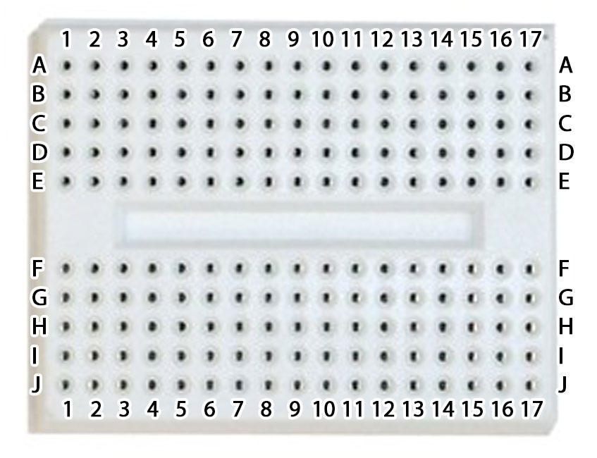

# raspberry-pi-button-invaders
A Raspberry Pi tutorial to make your own gamepad using a breadboard, momentary buttons and jumper cables and then play *Space Invaders*.

* 6 male-female GPIO jumper cables (also called DuPont cables, preferably of different colours)
* 3 momementary push-buttons
* 1 breadboard (a 17×5 breadboard works well)

For this tutorial Stuart recommended using the [Thonny IDE](http://thonny.org/), as you can toggle line-numbers. I also prefer the interface. Thonny is preinstalled on the current version of Raspbian.

1. Carefully place the momementary buttons onto the breadboard, the first one at **E1** and **E3**, the second one at **E5** and **E7** and the third one at **E15** and **E17**. I found that the buttons I was provided had awkward connectors that required cutting off using wire cutters in order to place into the breadboard. They can be bent at a 90 degree angle or if short enough just placed directly into the breadboard.

2. Connect the jumper cables onto the top row of the breadboard, by referring to the diagram above and table below. The tutorial recommends ensuring the Raspberry Pi has been shutdown and unplugged while doing this I experienced no ill-effect from connecting the jumper cables while plugged in and powered on.

|     Breadboard     |      Pi GPIO     |
|:------------------:|:----------------:|
|  **A1** - Wire to  | Pin 29 (GPIO 5)  |
|  **A3** - Wire to  | Pin 39 (GND      |
|  **A5** - Wire to  | Pin 31 (GPIO 6)  |
|  **A7** - Wire to  | Pin 25 (GND)     |
|  **A15** - Wire to | Pin 33 (GPIO 13) |
|  **A17** - Wire to | Pin 34 (GND)     |

3. Once connected test the configuration works correctly by opening and running `buttontest.py`, the correct output in the console should read as `Button 1`, `Button 2` and `Button 3` when each button is pressed. If this doesn't work check your connections or at worst isolate any faulty components and replace them.

4. Run `buttoninvaders.py` and set a high score. I plan on publishing my high score here for you to beat!

## Licensing
Like most [Cotswold Jam](http://cotswoldjam.org/) tutorials the instructional text and images are available in the public domain, or as I prefer [Creative Commons Zero (CC0)](https://creativecommons.org/publicdomain/zero/1.0/). The `buttontest.py` testing program is also available in the public domain.

The original `spaceinvaders-unmodified.py` program and the adapted `buttoninvaders.py` are available under the [MIT License](https://opensource.org/licenses/MIT) courtesy of its author [Lee Robinson](https://github.com/leerob) (original repository [here](https://github.com/leerob/Space_Invaders)).

The provided `space_invaders.ttf` font was built using FontStruct and may be licensed under the FontStruct License or available as Freeware. The copyright information in the file itself is "*Copyright kylemaoin 2010*".